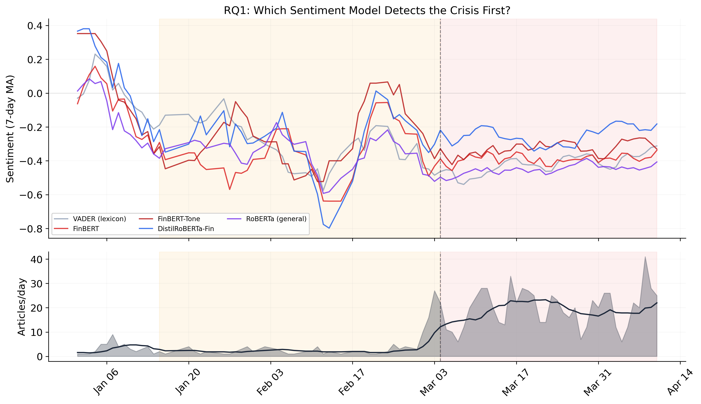
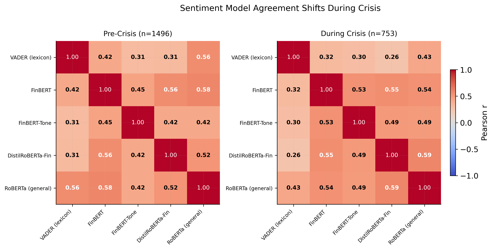
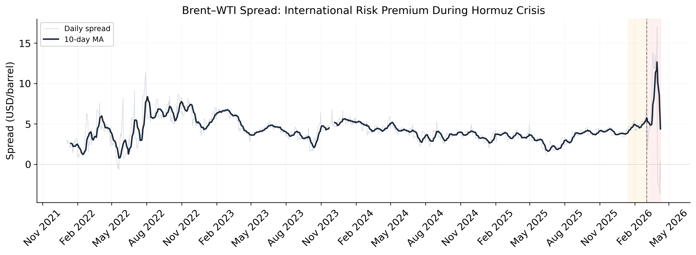

# Early Warning Signals for Geopolitical Oil Shocks: Detecting the Hormuz Crisis Through Multi-Model NLP Consensus

**KSU C-Day Spring 2026 | PhD Research**

College of Computing and Software Engineering, Kennesaw State University

---

## Overview

This project builds an NLP-based early warning system for geopolitical oil supply shocks, evaluated against the 2026 Strait of Hormuz closure. Five sentiment analysis models organized across three tiers score 2,249 Guardian news articles to test whether domain-specific NLP detects crisis signals before general-purpose models, and whether inter-model consensus predicts price volatility.

Financial-domain models detected the crisis **47 days** before closure, outperforming general-purpose models by 26 days. Article volume proved the strongest single volatility predictor (r=0.76), while model consensus — not disagreement — signals crisis severity. Forecasting experiments confirm that point prediction during unprecedented shocks remains fundamentally limited, reinforcing the value of upstream textual early warning.

---

## Research Questions

**RQ1:** Can NLP sentiment models detect early warning signals of the Hormuz oil shock before the March 4 closure, and which model tier detects it first?

**RQ2:** Does inter-model sentiment consensus predict next-day oil price volatility?

**RQ3:** Can NLP-derived features improve oil price forecasting during a geopolitical crisis, and does the benefit depend on model architecture?

---

## Project Structure

```
├── phase1_data_collection.ipynb     # Oil price data + Guardian article collection
├── phase2_sentiment.ipynb  # Five-model sentiment scoring + early warning
├── phase3_forecasting.ipynb  # LSTM (5-seed ensemble) + XGBoost forecasting
├── phase4_poster.ipynb           # Poster figures + key findings summary
├── data/
│   ├── oil_prices.csv               # Brent & WTI daily prices (Jan 2023 – Apr 2026)
│   ├── daily_sentiment.csv          # Daily aggregated sentiment scores
│   ├── article_sentiments.csv       # Per-article sentiment from all five models
│   ├── model_predictions.csv        # LSTM + XGBoost predictions (67 days)
│   └── country_exposure.csv         # Country oil dependency data
├── poster/                          # 300 DPI poster figures
└── README.md
```

---

## Data

| Source | Description | Size |
|--------|------------|------|
| Yahoo Finance (yfinance) | Brent & WTI crude daily prices | 1,073 trading days (Jan 2023 – Apr 2026) |
| The Guardian Content API | Oil/Hormuz-related news articles across 16 search queries | 2,249 articles filtered from 8,260 raw returns (Jul 2024 – Apr 2026) |

---

## Sentiment Models

Five deterministic, open-source models organized across three tiers:

| Tier | Model | Training Data | Parameters | Role |
|------|-------|--------------|------------|------|
| Lexicon | VADER | 7,500-word sentiment dictionary | Rule-based | Baseline — no language understanding, just word-counting |
| General Transformer | RoBERTa-CardiffNLP | 124M tweets | 125M | Control — understands language structure but no financial training |
| Financial Transformer | FinBERT (ProsusAI) | Reuters TRC2 + Financial PhraseBank (4,840 sentences) | 110M | Domain-specific — trained on financial news |
| Financial Transformer | FinBERT-Tone (yiyanghkust) | 10,000 annotated analyst report sentences | 110M | Domain-specific — trained on analyst reports and SEC filings |
| Financial Transformer | DistilRoBERTa-Financial (mrm8488) | Financial PhraseBank | 82M | Compressed financial model — half the size, 98.2% accuracy retained |

All models are deterministic: same input produces identical output every run. This is critical for RQ2, where inter-model disagreement must reflect architectural differences rather than sampling noise.

---

## Methods

### Early Warning Detection

A baseline is computed from all sentiment scores before January 1, 2026 (458 days of normal oil coverage). For each model, a 7-day rolling average of daily sentiment is tracked. An alarm triggers when this rolling average drops below one standard deviation of the baseline mean.

### Forecasting

Five LSTM variants evaluated via rolling walk-forward prediction across 67 trading days:

| Model | Features | Count | Purpose |
|-------|----------|-------|---------|
| A: Price Only | Brent close, returns, volatility, moving averages, Brent-WTI spread | 6 | Baseline: what can price history alone predict? |
| B: + Sentiment | A + FinBERT-Tone daily mean | 7 | Does the best single sentiment model help? |
| C: + Volume | A + article count, 7-day volume MA | 8 | Does media attention alone predict better than sentiment content? |
| D: + Consensus | A + all-model consensus, financial-model consensus | 8 | Does model agreement add predictive value? |
| E: All Features | A + all sentiment, volume, and consensus features | 15 | Does combining everything beat individual features? |

Architecture: 2-layer LSTM, 64 hidden units, 30-day lookback. Each variant trained across 5 random seeds [42, 123, 456, 789, 1024] with predictions averaged. Models retrain every 5 days via warm-start. Target: next-day price returns. XGBoost (deterministic, random_state=42) provides cross-architecture comparison. Persistence baseline (tomorrow = today) serves as forecasting floor.

---

## Results

### RQ1: Early Warning Detection

Financial-domain models detected the crisis 47 days before closure. General-purpose RoBERTa detected it 21 days early, and VADER 27 days early. Article volume provided only 2 days of warning. The 26-day gap between financial and general-purpose models suggests early signals were expressed in domain-specific language that general models didn't read as strongly negative.

| Model | Tier | Alarm Date | Days Before Crisis |
|-------|------|------------|-------------------|
| FinBERT-Tone | Financial | Jan 16, 2026 | **47 days** |
| DistilRoBERTa-Fin | Financial | Jan 16, 2026 | **47 days** |
| FinBERT | Financial | Jan 27, 2026 | 36 days |
| VADER | Lexicon | Feb 5, 2026 | 27 days |
| RoBERTa (general) | General | Feb 11, 2026 | 21 days |
| Article Volume | N/A | Mar 2, 2026 | 2 days |


*Top: 7-day rolling sentiment for all five models. Bottom: daily article volume. Sentiment drops weeks before volume spikes.*

### RQ2: Consensus and Volatility

Article volume is the strongest volatility predictor, outperforming all sentiment-based features. Model consensus, not disagreement, signals crisis severity. This inverts our original hypothesis — we expected disagreement to signal ambiguity and precede volatility, but convergence on negative sentiment marks the most volatile periods.

| Feature | Pearson r | p-value | Significant? |
|---------|-----------|---------|-------------|
| 7-day article volume | 0.758 | <0.0001 | Yes |
| Daily article count | 0.667 | <0.0001 | Yes |
| All-model disagreement (7d) | −0.519 | <0.0001 | Yes |
| Fin-model disagreement (7d) | −0.387 | <0.0001 | Yes |


*Inter-model correlations shift during the crisis. VADER diverges from transformer models. Financial transformers maintain higher agreement.*

### RQ3: Forecasting

All model variants converge near the persistence baseline ($6.82) during the crisis period, regardless of architecture or features. Bootstrap confidence intervals confirm no significant differences. NLP features don't improve point accuracy but do stabilize LSTM predictions across seeds. This convergence reinforces the value of early warning: if no model can forecast an unprecedented shock once it hits, detecting it 47 days early through text becomes the more actionable contribution.

| Model Variant | LSTM RMSE | vs LSTM A | Sig? | XGBoost RMSE | vs XGB A |
|---------------|-----------|-----------|------|-------------|----------|
| A: Price Only | $6.83 | baseline | — | $6.98 | baseline |
| B: + Sentiment | $6.81 | +0.3% | No | $7.08 | −1.4% |
| C: + Volume | $7.30 | −6.8% | No | $6.89 | +1.3% |
| D: + Consensus | $7.27 | −6.4% | No | $6.87 | +1.6% |
| E: All Features | $7.20 | −5.4% | No | $6.91 | +1.0% |

*LSTM: 5-seed ensemble-averaged predictions. XGBoost: deterministic. Persistence baseline: $6.82. All models converge near baseline during crisis.*

**Multi-seed LSTM stability** (per-seed crisis RMSE, mean ± std):

| Model | Crisis RMSE | Std |
|-------|------------|-----|
| A: Price Only | $9.68 | ±$1.56 |
| B: + Sentiment | $9.14 | ±$2.13 |
| C: + Volume | $8.51 | ±$0.96 |
| D: + Consensus | $8.50 | ±$0.92 |
| E: All Features | $9.29 | ±$1.43 |

*Models C and D show the lowest variance across seeds, indicating NLP features stabilize predictions even without reducing ensemble error.*

### Price Shock Context

The Hormuz closure produced a price shock of +$27.35/barrel (+36.6%) from a pre-crisis average of $74.64 to a crisis average of $102.00, peaking at $118.35.


*The Brent-WTI spread widened sharply during the crisis, confirming this was an international supply shock rather than a demand shock. If demand-driven, both benchmarks would move together.*

---

## Key Findings

1. **Domain-specific NLP provides 47 days of early warning** — nearly seven weeks before the event — outperforming general-purpose alternatives by 26 days. Financial-domain fine-tuning matters for crisis detection.

2. **Article volume predicts volatility better than sentiment content** (r=0.76). How many articles get written matters more than what they say.

3. **Model consensus signals crisis severity.** When all five models agree sentiment is negative, prices move most. Disagreement corresponds to calm, ambiguous periods.

4. **Point forecasting during unprecedented shocks is fundamentally limited.** All models converge near a naive baseline regardless of features or architecture, reinforcing the value of upstream textual early warning.

5. **NLP features stabilize LSTM predictions** even when they don't reduce ensemble error. Models with consensus features show the lowest cross-seed variance.

---

## Reproducibility

All five sentiment models are open-source and freely available on HuggingFace:

- `vaderSentiment` (pip install)
- `ProsusAI/finbert`
- `yiyanghkust/finbert-tone`
- `mrm8488/distilroberta-finetuned-financial-news-sentiment-analysis`
- `cardiffnlp/twitter-roberta-base-sentiment-latest`

Oil price data is retrieved via `yfinance`. News articles are retrieved via The Guardian Content API (free API key required).

### Requirements

```
torch
transformers
scikit-learn
xgboost
pandas
numpy
matplotlib
yfinance
vaderSentiment
ftfy
scipy
```

---

## References

Araci, D. (2019). FinBERT: Financial sentiment analysis with pre-trained language models. *arXiv preprint arXiv:1908.10063*. https://arxiv.org/abs/1908.10063

Barbieri, F., Camacho-Collados, J., Espinosa Anke, L., & Neves, L. (2020). TweetEval: Unified benchmark and comparative evaluation for tweet classification. In *Findings of the Association for Computational Linguistics: EMNLP 2020* (pp. 1644–1650). https://doi.org/10.18653/v1/2020.findings-emnlp.148

Hochreiter, S., & Schmidhuber, J. (1997). Long short-term memory. *Neural Computation, 9*(8), 1735–1780. https://doi.org/10.1162/neco.1997.9.8.1735

Hutto, C., & Gilbert, E. (2014). VADER: A parsimonious rule-based model for sentiment analysis of social media text. *Proceedings of the International AAAI Conference on Web and Social Media, 8*(1), 216–225. https://doi.org/10.1609/icwsm.v8i1.14550

Yang, Y., Uy, M. C. S., & Huang, A. (2020). FinBERT: A pretrained language model for financial communications. *arXiv preprint arXiv:2006.08097*. https://arxiv.org/abs/2006.08097

---

## Citation

If you use this work, please cite:

```
Ohalete, N. (2026). Early Warning Signals for Geopolitical Oil Shocks: Detecting the
Hormuz Crisis Through Multi-Model NLP Consensus. KSU C-Day Spring 2026, College of
Computing and Software Engineering, Kennesaw State University.
```

